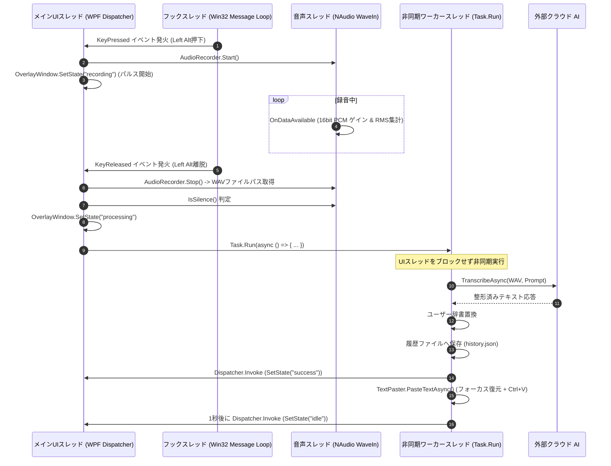

# Voice In - システムアーキテクチャ設計書

**文書バージョン**: 1.0.0  
**作成日**: 2026-09-04  
**ステータス**: 正式承認版  

---

## 1. 全体アーキテクチャ概要

Voice In は、プレゼンテーション層（WPF / Windows Forms）、オーケストレーション層（Application / ViewModels）、ビジネス・ドメイン層（音声処理、AIクライアント、テキスト変換）、インフラストラクチャ層（Win32 API, NAudio, HTTP Client, ファイルシステム）の4層から成るレイヤードアーキテクチャを採用している。

```mermaid
graph TB
    subgraph Presentation Layer ["UI / プレゼンテーション層"]
        Overlay[OverlayWindow <br/> 半透明丸型フローティング]
        Settings[SettingsWindow <br/> タブ付き設定ダイアログ]
        History[HistoryWindow <br/> 履歴閲覧 & コピー]
        Tray[System.Windows.Forms.NotifyIcon <br/> タスクトレイ常駐]
    end

    subgraph Application Layer ["アプリケーション・オーケストレーション層"]
        App[App.xaml.cs <br/> ライフサイクル & イベント連携]
    end

    subgraph Domain & Core Layer ["コア・ドメイン層"]
        subgraph AudioModule ["Audio サブシステム"]
            AudioRecorder[AudioRecorder <br/> 録音ライフサイクル管理]
            AudioProcessor[AudioSampleProcessor <br/> ゲイン適用 & RMS/Peak 集計]
        end

        subgraph AiModule ["AI サブシステム"]
            AiFactory[AiProviderFactory]
            IAi[<<interface>> IAiProvider]
            Gemini[GeminiProvider <br/> REST generateContent]
            Groq[GroqProvider <br/> Whisper + LLM]
        end

        subgraph ContextModule ["コンテキスト & テキスト"]
            WinDetector[WindowDetector <br/> プロセス & ウィンドウ認識]
            TextPaster[TextPaster <br/> クリップボード & キーストローク]
        end

        subgraph StorageModule ["設定 & 永続化"]
            EnvLoader[EnvLoader <br/> .env パーサー]
            SettingsMgr[SettingsManager <br/> settings.json 永続化]
            HistoryMgr[HistoryManager <br/> history.json 永続化]
            Logger[Logger <br/> ファイル出力ログ基盤]
        end
    end

    subgraph Infrastructure Layer ["インフラストラクチャ / OS・外部API"]
        NAudio[NAudio.Wave.WaveIn <br/> Windows CoreAudio / MME]
        Win32Hook[Win32 SetWindowsHookEx <br/> WH_KEYBOARD_LL]
        Win32Send[Win32 keybd_event / SetForegroundWindow]
        GeminiAPI[Google Generative Language API]
        GroqAPI[Groq Cloud API]
        FileSystem[Local AppData & Temp Files]
    end

    %% レイヤー間連携
    App --> Overlay
    App --> Tray
    App --> Settings
    App --> History
    App --> AudioRecorder
    App --> AiFactory
    App --> WinDetector
    App --> TextPaster

    AudioRecorder --> AudioProcessor
    AudioRecorder --> NAudio
    AudioRecorder --> FileSystem

    AiFactory --> IAi
    IAi <|.. Gemini
    IAi <|.. Groq
    Gemini --> GeminiAPI
    Groq --> GroqAPI

    App --> Win32Hook
    TextPaster --> Win32Send
    SettingsMgr --> FileSystem
    HistoryMgr --> FileSystem
    Logger --> FileSystem
```

---

## 2. スレッドモデルと非同期設計

デスクトップ常駐型ツールとして、UIの応答性（60fps）を完全に維持するため、長時間の処理（音声録音・API通信・キーストローク待機）はすべて専用のスレッドおよび非同期タスク（`async/await`）で実行される。



---

## 3. コンポーネント詳細設計

### 3.1 Core / Storage サブシステム
- **`EnvLoader`**:
  - アプリ実行ディレクトリおよび `%APPDATA%\VoiceIn` に存在する `.env` をパース。
  - セキュリティ上、APIキーなどの機密情報をコード内にハードコードせず、プロセス内環境変数としてのみメモリ保持。
- **`SettingsManager`**:
  - `settings.json` のシリアライズ/デシリアライズを担当。
  - ユーザー設定が欠落している場合は `AppSettings` クラスの既定値と自動マージして安全に初期化。
- **`HistoryManager`**:
  - 最大50件の文字起こし結果（タイムスタンプ、プロバイダ名、出力テキスト、エラー内容）を保存。
  - スレッドセーフなファイル置換更新（アトミックな一時ファイル書き込み）により破損を防止。

### 3.2 Audio サブシステム
- **`AudioRecorder`**:
  - NAudio の `WaveIn` をカプセル化。44.1kHz / 16-bit / Mono でキャプチャ。
  - 入力デバイス番号の指定と、最大録音タイマー（AutoStop）の管理。
- **`AudioSampleProcessor`**:
  - 純粋関数（副作用なし）として設計。
  - ゲイン適用 (`ApplyGain`): 入力dB値を線形倍率へ変換し、16bit PCMのクリッピング処理 (`short.MinValue`〜`short.MaxValue`) を安全に実施。奇数長バッファへのパディング安全性を担保。
  - 音声特徴量集計 (`Aggregate`): RMS計算用の二乗和積算とピーク絶対値の検出。

### 3.3 AI サブシステム
- **`IAiProvider` インターフェース**:
  ```csharp
  public interface IAiProvider
  {
      string ProviderName { get; }
      Task<string> TranscribeAsync(string audioFilePath, string prompt);
  }
  ```
- **`GeminiProvider`**:
  - HTTP `POST` により `https://generativelanguage.googleapis.com/v1beta/models/{model}:generateContent` を呼び出し。
  - WAV 音声データを Base64 文字列化し、リクエスト JSON の `inline_data` として埋め込み。
- **`GroqProvider`**:
  - 第1段階: `https://api.groq.com/openai/v1/audio/transcriptions` (MultipartFormData / `whisper-large-v3`) で素早く高精度な生テキストを取得。
  - 第2段階: `https://api.groq.com/openai/v1/chat/completions` (JSON / 既定 `openai/gpt-oss-120b`、`GROQ_REFINE_MODEL` で変更可) でシステムプロンプトに従った高度な文章整形を実施。

---

## 4. セキュリティと堅牢性設計

1. **ゼロコピー・ゼロリーク設計**:
   - ゲイン倍率が `1.0` (0dB) の場合、バッファの新規メモリ確保を行わず入力参照をそのまま透過。
   - 一時WAVファイルは `finally` 句で確実に削除。
2. **Win32 キーフックの安全性**:
   - `WH_KEYBOARD_LL` はOSの入力キュー全体にフックをかけるため、例外発生時やアプリ終了時に必ず `UnhookWindowsHookEx` を呼び出して安全に解除。
3. **アクティブウィンドウの保全**:
   - キー押下時に `GetForegroundWindow` でHWNDを取得。
   - テキストペースト時に万が一アクティブウィンドウが切り替わっていた場合は、フォーカス再アクティブ化を検証してから貼り付けを実施。
