# Voice In - クラス構造設計書 (Class Diagram)

**文書バージョン**: 1.0.0  
**作成日**: 2026-09-04  
**ステータス**: 正式承認版  

---

## 1. 全体クラス図 (Overview Class Diagram)

```mermaid
classDiagram
    %% Core & Entry Point
    class App {
        -Mutex _mutex
        -NotifyIcon _notifyIcon
        -OverlayWindow _overlayWindow
        -SettingsWindow _settingsWindow
        -HistoryWindow _historyWindow
        -KeyboardHook _keyboardHook
        -AudioRecorder _audioRecorder
        -WindowInfo _targetWindow
        -bool _isProcessing
        #OnStartup(StartupEventArgs e) void
        #OnExit(ExitEventArgs e) void
        -SetupNotifyIcon() void
        -UpdateTrayMenu() void
        -SwitchProvider(string provider) void
        -OnKeyPressed() void
        -OnKeyReleased() void
        -OnAutoStop() void
        -OpenSettings() void
        -OpenHistory() void
    }

    %% UI Classes
    class OverlayWindow {
        -DoubleAnimation _pulseAnimation
        -Storyboard _pulseStoryboard
        +event Action SettingsRequested
        +event Action HistoryRequested
        +event Action ExitRequested
        +SetState(string state) void
        -OnMouseLeftButtonDown(object sender, MouseButtonEventArgs e) void
        -OnMouseRightButtonUp(object sender, MouseButtonEventArgs e) void
    }

    class SettingsWindow {
        -ObservableCollection~DictEntry~ _dictEntries
        +event Action SettingsSaved
        -LoadSettings() void
        -OnSaveAndApply(object sender, RoutedEventArgs e) void
        -OnDeleteDictItem(object sender, RoutedEventArgs e) void
    }

    class HistoryWindow {
        -LoadHistory() void
        -OnCopyText(object sender, RoutedEventArgs e) void
        -OnClose(object sender, RoutedEventArgs e) void
    }

    %% Audio Subsystem
    class AudioRecorder {
        -WaveIn _waveIn
        -WaveFileWriter _writer
        -string _tempFilePath
        -Timer _autoStopTimer
        -long _totalSamples
        -double _sumSquared
        -float _peak
        +bool IsRecording
        +event Action AutoStopRequested
        +GetInputDevices()$ List~Index, Name~
        +Start(int? deviceIndex, int maxSeconds) void
        +Stop() string
        +IsSilence(double minDuration, double rmsThreshold, double peakThreshold) bool
        +Cleanup() void
        +Dispose() void
    }

    class AudioSampleProcessor {
        <<static>>
        +DbToLinearGain(double gainDb)$ double
        +ApplyGain(byte[] buffer, int bytesRecorded, double gainMultiplier)$ byte[]
        +Aggregate(byte[] buffer, int bytesRecorded)$ (long, double, float)
    }

    %% AI Subsystem
    class IAiProvider {
        <<interface>>
        +string ProviderName*
        +TranscribeAsync(string audioFilePath, string prompt)* Task~string~
    }

    class GeminiProvider {
        -HttpClient _httpClient
        +string ProviderName
        +TranscribeAsync(string audioFilePath, string prompt) Task~string~
    }

    class GroqProvider {
        -HttpClient _httpClient
        +string ProviderName
        +TranscribeAsync(string audioFilePath, string prompt) Task~string~
        -TranscribeAudioAsync(string audioFilePath, string apiKey, string prompt) Task~string~
        -RefineTextAsync(string rawText, string apiKey, string systemPrompt) Task~string~
    }

    class AiProviderFactory {
        <<static>>
        +CreateProvider(string? providerName)$ IAiProvider
    }

    %% Core Services & Utilities
    class SettingsManager {
        -string _settingsPath
        +AppSettings Settings
        +string CurrentProvider
        +SettingsManager Instance$
        +Load() void
        +Save() void
    }

    class AppSettings {
        +AudioSettings Audio
        +UiSettings Ui
        +PromptSettings Prompts
        +Dictionary~string, string~ Dictionary
        +bool ContextAwareEnabled
        +Dictionary~string, List~string~~ AppCategories
        +Dictionary~string, string~ CategoryPrompts
    }

    class HistoryManager {
        -string _historyPath
        +HistoryManager Instance$
        +LoadItems() List~HistoryItem~
        +AppendItem(string text, string error, string provider) void
    }

    class KeyboardHook {
        -IntPtr _hookId
        -LowLevelKeyboardProc _proc
        -bool _isKeyPressed
        +event Action KeyPressed
        +event Action KeyReleased
        +Start() void
        +Stop() void
        +Dispose() void
    }

    class WindowDetector {
        <<static>>
        +GetActiveWindow()$ WindowInfo
        +DetectCategory(WindowInfo info, AppSettings settings)$ string
    }

    class TextPaster {
        <<static>>
        +PasteTextAsync(string text, IntPtr targetHwnd, int delayMs)$ Task
    }

    class Logger {
        <<static>>
        +Info(string message)$ void
        +Warn(string message)$ void
        +Error(string message, Exception ex)$ void
    }

    %% Relationships
    App --> OverlayWindow : owns
    App --> SettingsWindow : opens
    App --> HistoryWindow : opens
    App --> KeyboardHook : listens
    App --> AudioRecorder : controls
    App --> WindowDetector : uses
    App --> TextPaster : uses
    App --> AiProviderFactory : resolves
    App --> SettingsManager : observes
    App --> HistoryManager : writes

    AudioRecorder ..> AudioSampleProcessor : delegates audio math
    AiProviderFactory ..> IAiProvider : creates
    IAiProvider <|.. GeminiProvider : implements
    IAiProvider <|.. GroqProvider : implements

    SettingsManager --> AppSettings : manages
    SettingsWindow --> SettingsManager : edits
    HistoryWindow --> HistoryManager : reads
```

---

## 2. クラス責務と設計原則 (SOLID 原則)

### 2.1 単一責任の原則 (Single Responsibility Principle: SRP)
- **`AudioSampleProcessor`**:
  - 音声データのバイト単位での演算（ゲイン増幅、クリッピング、RMS/Peak 集計）のみを担当。
  - OS デバイスや NAudio のインターフェースから完全に切り離されているため、100% 単体テスト可能。
- **`TextPaster`**:
  - テキストを安全にターゲットウィンドウへ送り届けること（クリップボード設定、ウィンドウ切り替え、キーストローク送出）のみに専念。
- **`WindowDetector`**:
  - Win32 API によるアクティブプロセスの検査と、定義済みキーワードによるカテゴリ（`DEV`/`BIZ`/`DOC`/`STD`）の割り当てのみを担当。

### 2.2 開放閉鎖の原則 (Open/Closed Principle: OCP)
- **`IAiProvider`**:
  - 将来的にローカル実行エンジン（`Whisper.net` や `Ollama`）や他のクラウド API（OpenAI, Claude 等）を追加する際、既存の `App` や UI コードを一切変更することなく、新しいプロバイダクラスを追加して `AiProviderFactory` の分岐を拡張するだけで対応可能。

### 2.3 依存性逆転の原則 (Dependency Inversion Principle: DIP)
- `App` は具体的な `GeminiProvider` や `GroqProvider` に直接依存せず、抽象インターフェース `IAiProvider` を介して文字起こしを呼び出す設計となっている。
