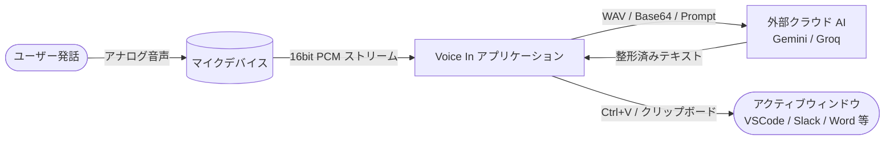
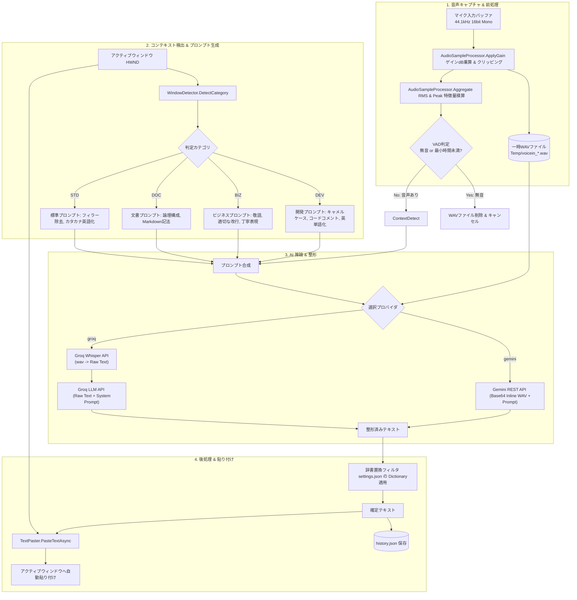

# Voice In - データフロー図 & 状態遷移図

**文書バージョン**: 1.0.0  
**作成日**: 2026-09-04  
**ステータス**: 正式承認版  

---

## 1. UI 状態遷移図 (Overlay Window State Machine)

デスクトップ右下に常駐する丸型フローティングオーバーレイ (`OverlayWindow`) は、アプリケーションのライフサイクルおよび音声認識パイプラインの進行状況に応じて、5つの明確な状態を遷移する。

```mermaid
stateDiagram-v2
    [*] --> Idle : アプリケーション起動 / 設定復元

    state Idle {
        [*] --> Waiting
        note right of Waiting
            アイコン: 🎤 (マイク)
            背景: 半透明ダークグラデーション
            枠線: プロバイダカラー
            (Gemini=#4285F4, Groq=#F55036)
            不透明度: 0.90
        end note
    }

    state Recording {
        [*] --> Capturing
        note right of Capturing
            アイコン: 🎙️
            背景: 赤色グラデーション
            枠線: #FF6B6B
            アニメーション: 不透明度 0.85〜1.0 パルスループ
        end note
    }

    state Processing {
        [*] --> Analyzing
        note right of Analyzing
            アイコン: ⏳
            背景: 黄色グラデーション
            枠線: #FFD93D
            パルス停止
        end note
    }

    state Success {
        [*] --> Completed
        note right of Completed
            アイコン: ✅
            背景: 緑色グラデーション
            枠線: #4ADE80
            テキスト自動ペースト実行
        end note
    }

    state Error {
        [*] --> Failed
        note right of Failed
            アイコン: ❌
            背景: 濃赤色グラデーション
            枠線: #EF4444
            トレイバルーン通知表示
        end note
    }

    %% 状態遷移イベント
    Idle --> Recording : ホットキー押下 (KeyPressed)
    Recording --> Processing : ホットキー離脱 (KeyReleased & 音声あり)
    Recording --> Idle : ホットキー離脱 (VAD無音判定)
    Recording --> Processing : 最大録音時間到達 (AutoStopRequested)
    Recording --> Error : マイク初期化・録音開始失敗

    Processing --> Success : AI文字起こし & 整形成功
    Processing --> Error : API例外 / ネットワーク切断 / 認証エラー

    Success --> Idle : 1000ms タイマー経過 (自動復帰)
    Error --> Idle : 2000ms タイマー経過 (自動復帰)

    Idle --> [*] : メニュー「終了」押下
```



---

## 2. データフロー図 (Data Flow Diagram: DFD)

### 2.1 レベル 0: コンテキスト・データフロー図
ユーザー発話、外部クラウドAI、入力対象アプリケーション間のデータの流れを示す。



---

### 2.2 レベル 1: 音声認識・テキスト整形・入力パイプライン詳細 DFD



---

## 3. データエンティティ定義

### 3.1 設定エンティティ (`settings.json`)
```json
{
  "audio": {
    "input_device": null,
    "input_gain_db": 0.0,
    "max_record_seconds": 60,
    "min_duration": 0.2,
    "auto_paste": true,
    "paste_delay_ms": 60,
    "hold_key": "alt_l"
  },
  "ui": {
    "language": "ja",
    "overlay_x": 1820.0,
    "overlay_y": 980.0
  },
  "prompts": {
    "groq_whisper_prompt": "あなたは一流のプロの文字起こし専門家です...",
    "groq_refine_system_prompt": "あなたは優秀なテクニカルライターAIです...",
    "gemini_transcribe_prompt": "あなたは文字起こしのスペシャリストであり..."
  },
  "dictionary": {
    "ボイスイン": "Voice In",
    "パイソン": "Python"
  },
  "context_aware_enabled": true
}
```

### 3.2 履歴エンティティ (`history.json`)
```json
{
  "version": 1,
  "items": [
    {
      "id": "1725450000000",
      "created_at": "2026-09-04T22:30:00+09:00",
      "provider": "gemini",
      "text": "本日の進捗状況についてご報告いたします。",
      "error": null
    }
  ]
}
```
