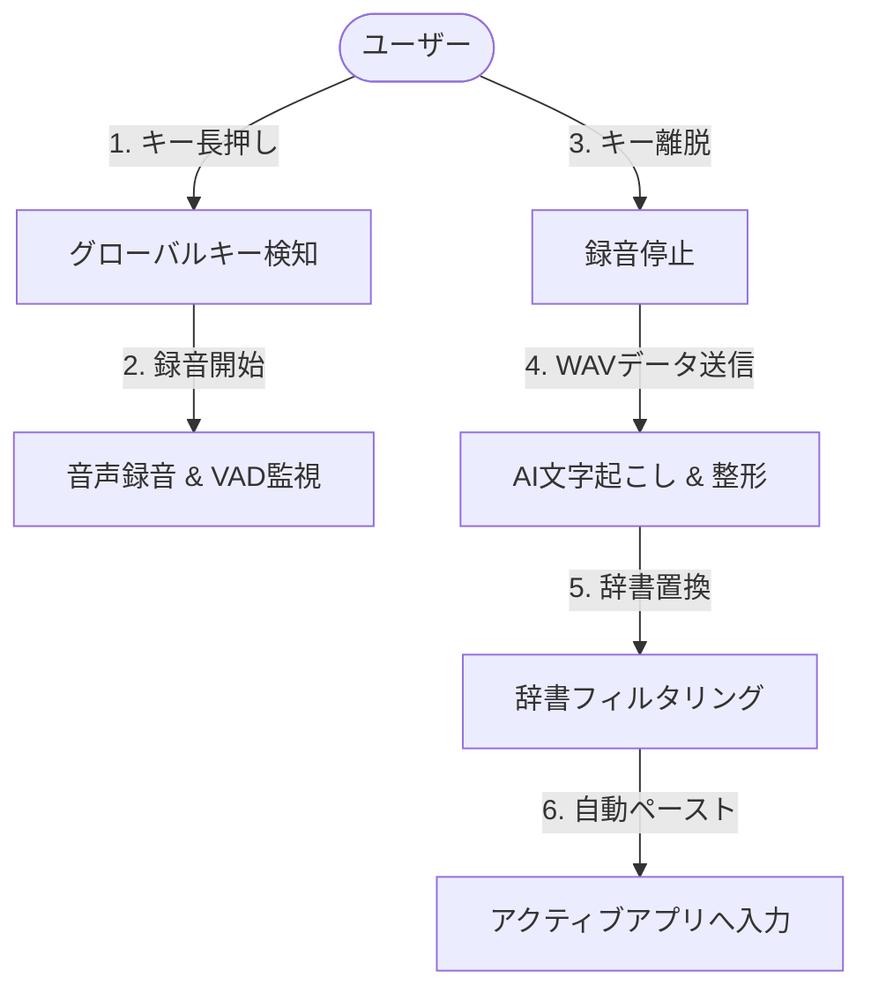

# Voice In - システム要件定義書

**文書バージョン**: 1.0.0  
**作成日**: 2026-09-04  
**ステータス**: 正式承認版  
**対象システム**: Voice In (C# / .NET 10 / Windows WPF)

---

## 1. システム概要と開発の背景

### 1.1 目的
Voice In は、Windows OS 上で動作するあらゆるデスクトップアプリケーション（IDE、ブラウザ、チャットツール、オフィスソフトなど）に対して、グローバルショートカットキーの長押し操作のみで高精度な音声入力・自動文章整形・自動テキスト貼付（Auto Paste）を提供するデスクトップ常駐型アシスタントツールである。

### 1.2 背景と課題
従来の音声入力システムや OS 標準の音声認識機能には、以下の重大な課題が存在していた：
1. **フィラーや言い淀みの混入**: 「えーっと」「あー」などの発話ノイズや重複した語句がそのまま入力され、手動での修正コストが高かった。
2. **専門用語・IT用語の誤変換**: カタカナ言葉で出力されたり（例:「パイソン」）、誤った漢字に変換され、プログラミングやビジネスチャットで実用に耐えなかった。
3. **アクティブウィンドウへの直接入力の難しさ**: 音声認識アプリ側のウィンドウにフォーカスを奪われ、元の入力先へ戻って貼り付けるという煩雑な手順が必要だった。
4. **Python実装版における課題**: 先行して開発された Python (PyQt6 + Rust) 版では、起動時間の遅さ（コールドスタートのオーバーヘッド）、常駐時のメモリ消費量（200MB超）、Python ランタイム同梱による配布サイズの肥大化、Windows ネイティブ API (Win32 P/Invoke) との連携の複雑さがボトルネックとなっていた。

本システムは、これらすべての課題を解決するため、**C# (.NET 10 / WPF)** によりゼロから完全再設計・リプレイスされた。

---

## 2. 用語の定義

| 用語 | 説明 |
| :--- | :--- |
| **グローバルホットキー** | アプリが非アクティブな状態でもシステム全体でキー押下・離脱を検知する仕組み（Win32 Low-Level Keyboard Hook）。 |
| **Auto Paste** | 音声のテキスト化・整形完了後、録音開始時にアクティブだったウィンドウへ自動的にテキストをフォーカス復元して貼り付ける機能。 |
| **VAD (Voice Activity Detection)** | 音声区間検出。録音された音声波形の RMS（二乗平均平方根）および Peak 値を解析し、無音または微小ノイズかを判定するロジック。 |
| **コンテキスト認識** | アクティブウィンドウのタイトルやプロセス名から「開発」「ビジネス」「文書」「標準」の各カテゴリを判別し、AIプロンプトを動的に最適化する仕組み。 |
| **プロバイダ (Provider)** | 音声認識およびテキスト整形を担当する外部 AI サービス（Google Gemini、Groq）。 |

---

## 3. ユーザーペルソナとユースケース

### 3.1 ペルソナ
- **ソフトウェアエンジニア / 情シス担当者**:
  - キーボード打鍵の手首疲労を軽減したい。
  - コードコメント、PRの説明文、コミットメッセージ、Slackの連絡を英語の専門用語（Git, Docker, Python等）を崩さずに素早く入力したい。
- **ビジネスパーソン / ライター**:
  - メモ帳やWord、Notionで長文のアイデアを思考の速度で入力したい。
  - 口語体で喋った内容を自動で「です・ます調」の整ったビジネス文として出力させたい。

### 3.2 主要ユースケース

---

## 4. 機能要件 (Functional Requirements)

| 要件ID | 大項目 | 機能名 | 詳細仕様 |
| :--- | :--- | :--- | :--- |
| **FR-001** | 音声入力 | ホットキー録音制御 | 設定されたキー（デフォルト: `Left Alt`、変更可能: `Right Alt`, `Left Ctrl`, `Right Ctrl`）の押下で録音を開始し、離脱で停止する。 |
| **FR-002** | 音声入力 | デバイス選択 & ゲイン調整 | システムに接続されたマイクを列挙・選択可能。入力ゲイン（dB）による増幅・減衰処理およびクリッピング防止を実装。 |
| **FR-003** | 音声入力 | 最大録音時間制限 | 設定された最大録音時間（1〜300秒、デフォルト60秒）を超過した場合、自動で録音を停止し処理へ移行する。 |
| **FR-004** | 音声入力 | VAD (無音判定) | 最小録音時間（デフォルト0.2秒）未満、または RMS < 0.005 かつ Peak < 0.02 の場合は無音とみなし、API呼び出しを行わずに処理をキャンセルする。 |
| **FR-005** | AI連携 | Gemini プロバイダ | Google Gemini API (`generateContent`) を使用。WAVをBase64インライン化して送信し、モデル指定（gemini-2.5-flash等）に対応。 |
| **FR-006** | AI連携 | Groq プロバイダ | Groq Whisper API (既定 `whisper-large-v3`、`GROQ_WHISPER_MODEL` で変更可) による文字起こし専用。文章整形は Groq では行わず、設定 `refine_provider` で選んだ整形バックエンド (Gemini: 既定 `gemini-flash-lite-latest` / `GEMINI_REFINE_MODEL`、NVIDIA: 既定 `nvidia/nemotron-3.5-lightning-30b-a3b` / `NVIDIA_REFINE_MODEL`) が担当する。整形が失敗した場合や空の応答を返した場合は、文字起こし結果をそのまま採用する (発話を失わない)。 |
| **FR-007** | AI連携 | コンテキスト認識 | アクティブウィンドウのプロセス・タイトルから `DEV`, `BIZ`, `DOC`, `STD` を判定し、それぞれの文脈に最適化されたプロンプトを付与する。 |
| **FR-008** | テキスト処理 | 辞書置換 | ユーザーが登録した「置換前 → 置換後」の単語ペアに基づき、AI整形後のテキストを確定前に強制置換する。 |
| **FR-009** | テキスト処理 | 自動貼り付け (Auto Paste) | 録音開始時のアクティブウィンドウハンドル (HWND) を記憶し、クリップボード格納後に修飾キーを解除して `Ctrl + V` を注入する。 |
| **FR-010** | UI | フローティングオーバーレイ | 画面右下に常駐する透過・丸型UI。状態に応じてアイコン・枠線色・グラデーション・パルスアニメーションが変化。ドラッグ移動と座標保存に対応。 |
| **FR-011** | UI | タスクトレイ常駐 | システムトレイ (NotifyIcon) に常駐し、プロバイダ切替、設定・履歴ダイアログの表示、表示/非表示切替、終了メニューを提供。 |
| **FR-012** | 設定・履歴 | 永続化と管理 | 環境変数（`.env`）および `settings.json`（設定）、`history.json`（直近50件の文字起こし履歴）の読み書き・検索・クリップボード再コピーを提供。 |

---

## 5. 非機能要件 (Non-Functional Requirements)

### 5.1 性能・パフォーマンス
- **起動時間 (Cold Start)**: 0.5秒以内（ネイティブAOTや最適化された.NETランタイムを活用）。
- **メモリフットプリント**: アイドル常駐時 40MB〜60MB 以内（Python版の 200MB 超から 70% 削減）。
- **入力レイテンシ**:
  - キー離脱から API リクエスト発行まで: 10ms 以内。
  - API 応答からテキスト貼り付け完了まで: 50ms 以内（設定遅延を除く）。

### 5.2 信頼性・可用性
- **例外の完全捕捉**: ネットワーク切断、APIレート制限、マイク切断等の異常時にもアプリケーションがクラッシュせず、オーバーレイに「❌」を表示しトレイ通知でエラー内容を明示する。
- **二重起動防止**: システムミューテックス (`VoiceIn_Application_SingleInstance_Mutex`) により二重起動を抑止する。
- **クリップボード保全**: テキスト貼り付け時に既存のクリップボード内容を一時退避し、貼り付け後に復元するオプション設計。

### 5.3 セキュリティ
- **APIキーの秘匿**: `.env` ファイルに保存し、リポジトリやバージョン管理から `.gitignore` により完全除外する。
- **音声データのプライバシー**: 一時WAVファイルはローカルの `Temp` ディレクトリに生成され、API送信完了後に即時完全削除される。

### 5.4 運用・保守性
- **テスト網羅性**: コアロジック（ゲイン計算、VAD、設定マージ、履歴管理）に対して xUnit による単体テストを完備し、CIでの自動検証を保証する。
- **構造化ロギング**: `%APPDATA%\VoiceIn\app.log` へ日付・ログレベル・エラー詳細を出力。
