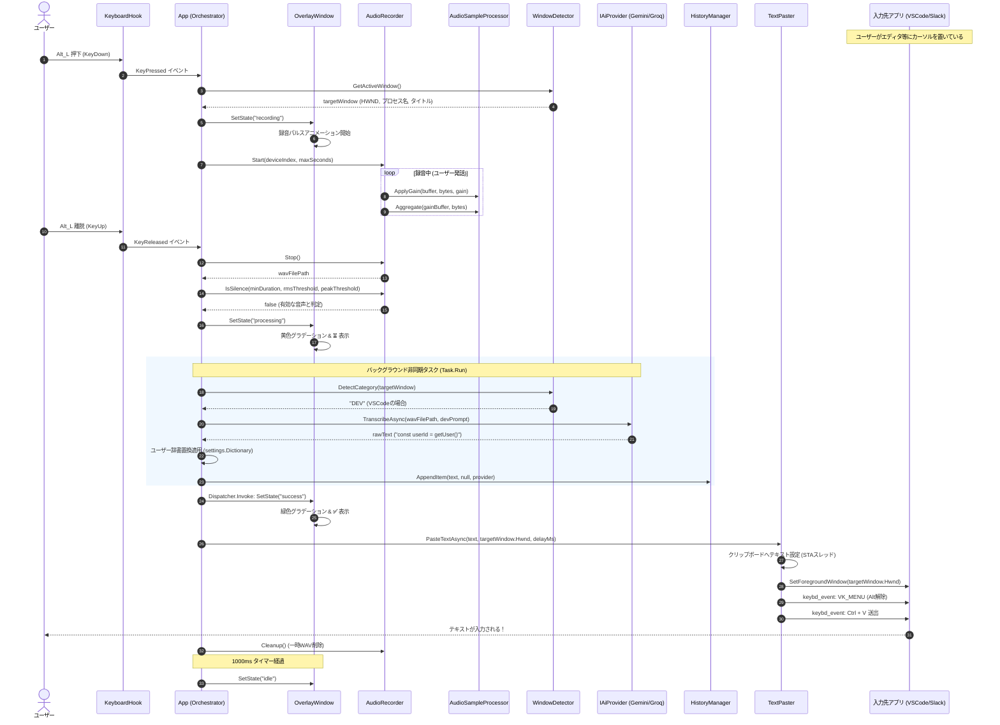
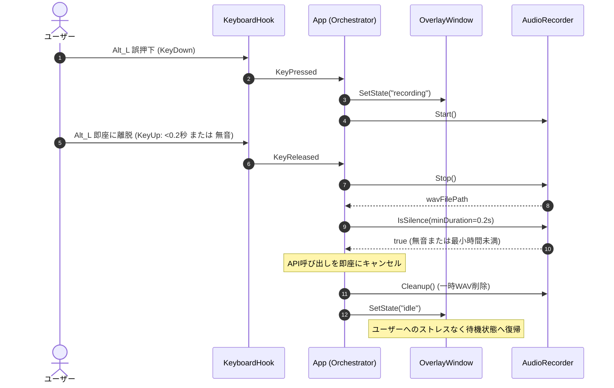
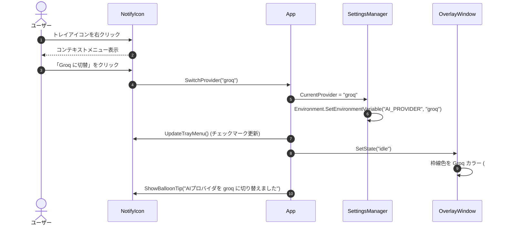
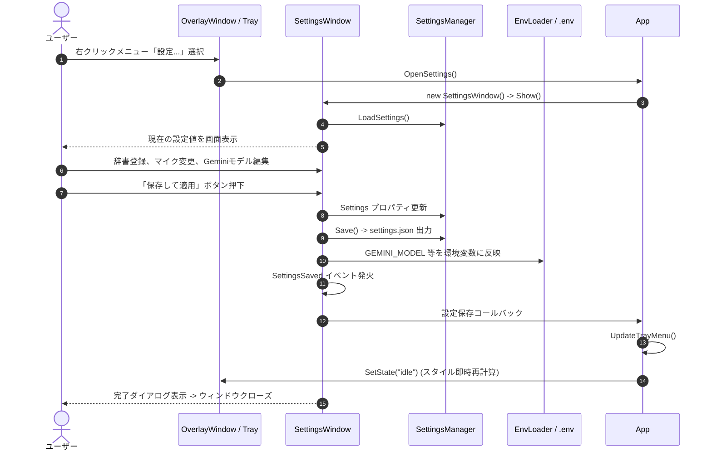
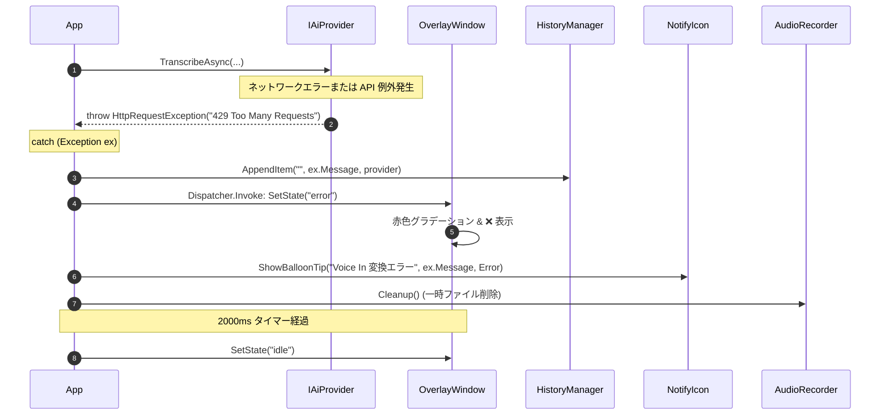

# Voice In - シーケンス図集

**文書バージョン**: 1.0.0  
**作成日**: 2026-09-04  
**ステータス**: 正式承認版  

---

## 1. 音声入力・文字起こし・自動貼り付け (正常系)

ユーザーが `Left Alt` を長押しして話し、離すと自動的にアクティブウィンドウへ貼り付けられるメインフロー。

---

## 2. VAD による無音・誤タッチの自動キャンセル (VAD スキップ)

誤ってキーに触れた場合や、無音状態でキーを離した際に、不要な API リクエストを送信せず即座に復帰するフロー。

---

## 3. AI プロバイダの即時切り替えフロー

タスクトレイのメニューから Gemini と Groq をワンクリックで切り替えるフロー。

---

## 4. 設定変更と永続化フロー

設定ダイアログでプロンプトや録音キー、辞書を変更し、適用するフロー。

---

## 5. API エラー・ネットワーク切断時の回復フロー

外部 API のレート制限（429）やネットワーク切断時、クラッシュを防止し安全に復帰するフロー。

